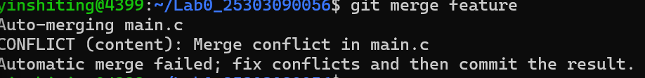
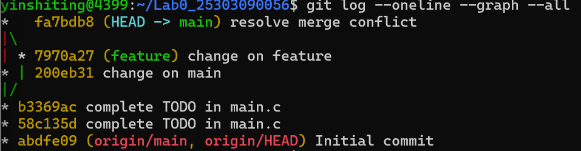

Lab0: GitLab 实验报告

- 姓名：孙嘉誉
- 学号：25303090056
- GitHub 仓库：https://github.com/sunjiayu0822-lgtm/Lab0_25303090056

一、文档问题回答

Q1：你之前有过多人协同开发的经历吗？

我曾与一位 AI 助手（Claude）共同开发过一个批改作业的小工具。分工上，我负责提出需求、设计功能和测试验证，AI 负责生成代码、查找 bug 并给出改进建议。我们通过对话的方式迭代：我描述想要的功能，AI 写出代码，我运行后反馈问题，AI 再修改。

这个过程中最大的痛点是版本管理：每次 AI 修改代码后，旧版本就被覆盖了。一旦新改动引入 bug，我经常找不回之前能正常运行的版本，只能让 AI 重新写。这让我深刻体会到，没有版本控制时，哪怕只是"两个人"（人和 AI）协作修改代码，也会很快陷入混乱。这也是我后来重视 Git 的原因。

Q2：Git 为什么要设计"暂存-提交"两个步骤？

我认为"暂存-提交"两步设计有三个好处：

1. 选择性提交：一次 commit 可以只包含相关的一批改动，避免把无关的、临时的文件一起提交进去，让每次提交都语义清晰。
2. 提交前检查：`git add` 之后、`git commit` 之前，还可以用 `git status`、`git diff` 再次确认到底要提交哪些内容，避免误提交。
3. 精细控制：同一个文件的不同改动可以分批提交（例如用 `git add -p` 只选择部分改动），实现更细粒度的历史记录。

Q3：`git branch` 和 `git branch -a` 的区别？

- `git branch`：只列出本地分支。
- `git branch -a`：列出所有分支，包括本地分支和远程跟踪分支
`-a` 多出来的那些 `remotes/origin/xxx`，就是远程仓库在本地的引用。

二、为什么要学习 Git

我阅读了下面两篇文章：

1. 《Commit message 和 Change log 编写指南》

这篇文章介绍了如何写规范的提交信息：用 `type`（如 feat、fix、docs）、`scope`、`subject` 等结构化字段描述一次改动，好处是提交历史一目了然，甚至可以自动生成 Change log。

2. 《Git Flow 分支控制》

Git Flow 提出了一套分支管理模型：用 `main`、`develop`、`feature`、`release`、`hotfix` 等分支来组织开发、发布和修复的流程，让多人协作时各自的改动互不干扰，又有条不紊地合入主干。

我的理解：Git 是团队协作的"基础设施"。它解决的核心问题是——多个人（或人和 AI）同时改代码时，如何记录历史、随时回退、并行开发、安全合并。而规范（规范的提交信息、规范的分支模型）则让这套协作更高效、更可维护。学 Git 不只是学几个命令，更是学习一种可追溯、可协作的工作方式。

三、实验步骤与截图

1. 创建个人仓库：使用模板仓库 `ICS-26Fall-FDU/GitLab` 的 "Use this template" 功能，创建个人仓库 `Lab0_25303090056`。
2. 配置环境：在 WSL 中配置 `git config --global user.name` 和 `user.email`，生成 SSH 密钥并添加到 GitHub。
3. 克隆仓库：
   ```bash
   git clone git@github.com:sunjiayu0822-lgtm/Lab0_25303090056.git
   ```
   4. 完成任务 TODO：修改 `main.c` 中的打印语句，编译运行验证：
   ```bash
   make && ./main && make clean
   ```
   程序输出 `Hello, yinshiting!`，随后提交。
5. 分支管理：
   - 新建 `feature` 分支，在 `feature` 上修改 `main.c` 并提交；
   - 切回 `main` 分支，修改 `main.c` 的同一行并提交。

6. 合并与解决冲突：执行 `git merge feature`，出现合并冲突：
   

   手动编辑 `main.c`，删除冲突标记（`<<<<<<<`、`=======`、`>>>>>>>`）、保留最终版本后提交，冲突解决：
   
四、建议

简易让助教可以在实验课上带着做一下作业并讲解一下每一步的含义，这样可以减少学生自己探索时的疑惑和对ai的依赖
